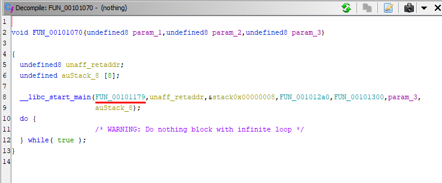
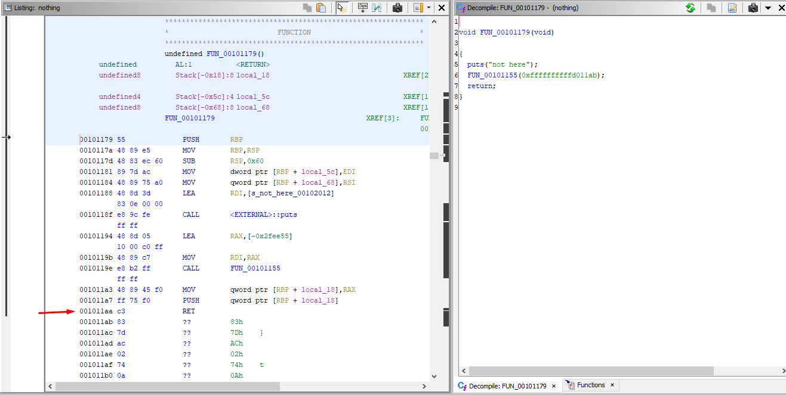

# Nothing (TAMUctf 2023)

## Challenge

Author: anomie

This program seems to be taunting me, I'm sure there's something here...

## Solution

### Understanding the binary

First, every time I'm dealing with a reverse binary challenge, I always run some commands to undertand it better. In this case, after unzipping the file, we can run:

```bash
file nothing
--------------
nothing: ELF 64-bit LSB pie executable, x86-64, version 1 (SYSV), dynamically linked, interpreter /lib64/ld-linux-x86-64.so.2, for GNU/Linux 3.2.0, BuildID[sha1]=8605599b93fbf88673bdc45d8cfd297392ab51d8, stripped
```

It's a stripped ELF executable (we don't have symbols to see function names and these stuffs). Also, it's dinamically linked, so it doesn't contain the libs inside the binary (that way is easier to reverse).

Good commands to check are:

```bash
strings nothing
binwalk nothing
```

We can see that it was compiled using GCC, so Ghidra will probably do a good job on it. Also, the binwalk can sometimes show any hidden file (not the case here).

If we run the binary:

```bash
./nothing
--------------
not here
also not here
```

### Patching

After we analyse the binary on Ghidra, we can start searching for the **main** function. Since it's stripped, we're gonna look for **__libc_start_main** function on the code, because it's first argument is our **main**.



That's the one. There's a RET instruction that cuts our main function in a half. Hence, let's patch this instruction out, on Ghidra you can use "CTRL + SHIFT + G" and substitute it for a NOP. After doing that, let's export the patched binary, using the shortcut "O", and saving as ELF format.



### Solving

Analysing the new patched file, renaming, changing types and cleaning up some stuff in the **main** function, we can get a more legible reversed code:

```C
int main(int argc,char **argv){
  int result;
  size_t length;
  char good [4];
  char xored_flag [32];
  long res_also_not_here;
  ulong i;
  
  puts("not here");
  also_not_here(0xffffffffffd011ab);
  if (argc == 2) {
    xored_flag._0_8_ = 0x626e7e6966656867;
    xored_flag._8_8_ = 0x6068527964735671;
    xored_flag._16_8_ = 0x48737d604c767f65;
    xored_flag._24_8_ = 0x62737c6e7c756b68;
    good[0] = 'g';
    good[1] = 'o';
    good[2] = 'o';
    good[3] = 'd';
    i = 0;
    while( true ) {
      length = strlen(argv[1]);
      if (length <= i) break;
      argv[1][i] = argv[1][i] ^ (byte)i;
      i = i + 1;
    }
    result = strcmp(argv[1],xored_flag);
    if (result == 0) {
      puts(good);
    }
    result = 0;
  }
  else {
    result = -1;
  }
  return result;
}
```

The program is comparing our argv, after some xor operations with the bytes of what I called "xored_flag".

```C
i = 0;

while( true ) {
  length = strlen(argv[1]);
  if (length <= i) break;
  argv[1][i] = argv[1][i] ^ (byte)i;
  i = i + 1;
}

result = strcmp(argv[1],xored_flag);
```

Note the iteration of every character of our input, changing each one for the xor of itself with it's position. For example, if we call:

```bash
./nothing_patched test
```

It's gonna do:

```
new_letter_0 = 't' ^ 0;
new_letter_1 = 'e' ^ 1;
new_letter_2 = 's' ^ 2;
new_letter_3 = 't' ^ 3;
```

To solve this, I'm gonna reverse the logic of this loop, to transform the **xored_flag** in the flag itself. The while loop does:

```
xored_flag[i] = flag[i] ^ i;
```

Since we have **xored_flag**, but not flag, let's just pass de "^i" to the other side:

```
flag[i] = xored_flag[i] ^ i;
```

Now for the iteration, we have to do it in reverse as well, starting at the highest *i* (length-1) and finishing at the lowest *i* (0). I've crafted a python script for this:

```python
#!/usr/bin/env python3

xored_flag = bytes.fromhex('67686566697e6e627156736479526860657f764c607d7348686b757c6e7c7362') # The hex value of xored_flag, it's in this exact order because of little endianness
length = len(xored_flag)

flag = ''

for i in range(length-1, -1, -1): # every byte from the last to the first
    flag = chr(xored_flag[i]^i) + flag

print(flag)
```

<aside>
⛳ The flag: gigem{hey_you_found_the_program}
</aside>